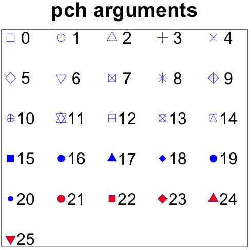
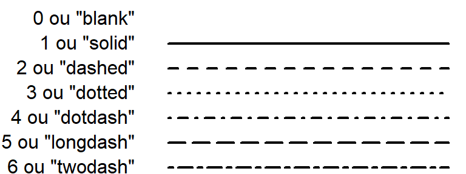

```{r setup, include=FALSE}
knitr::opts_chunk$set(echo = TRUE)
```

Dans ce cours, nous verrons les bases pour bien commencer. Il est basé sur un cours de Gaëlle Lelandais.

## Ouvrir R

### Dans une console 

Dans une console, il suffit de saisir le commande : R

### Dans Rstudio

Ici rien à faire, Rstudio ouvre automatiquement un console R. R Studio vous propose aussi un éditeur de texte. J'utilise pour ma part quotidiennement R-Studio. Un petit tour des possibilités de R-studio :

<center>
<iframe width="560" height="315"  src="https://www.youtube.com/embed/n3uue28FD0w" frameborder="0" allow="autoplay; encrypted-media" allowfullscreen></iframe></center>

## Premier pas 

R est avant tout une calculatrice extrêmement puissante.

```{r}
1+1/4
```

```{r}
(1+1)/4
```

```{r}
21.3*3
```

## Qu'est ce qu'une fonction?

Une fonction est un ensemble de commandes pré-programmées.
Une fonction se caractérise par 

* Son nom
* Ses arguments (informations préalables, nécessaires à l'exécution de la fonction). Ses arguments sont placés entre parenthèses.


Exemples de noms de fonction : ```cos(); mean(); var();```

Exemple d'utilisation : Racine carrée de 16
```{r}
sqrt(16)
```

## Gérer son répertoire de travail

Dans quel répertoire je travaille? ```getwd()```

Changer de répertoire : ```setwd()```

Mise en pratique :
```{r}
getwd()
```

```{r}
setwd("..")
getwd()
```

## Obtenir de l'aide 

Pour avoir de l'aide, il existe plusieurs méthodes :

* ?NomDeLaFonction :```?mean```
* help(NomDeLaFonction) : ```help(mean)```
* ```help.start()```
* Google !

Dans l'aide, vous trouverez différentes sections :

Sections      | Indications
------------- | -------------
*Description* | A quoi sert la fonction ?
*Usage*       | Comment utiliser la fonction ?
*Arguments*   | Quels paramètres utilise la fonction en entrée ?
*Details*     | Description technique de la fonction
*Value*       | Quels paramètres sont retournés par la fonction en sortie ?
*See also*    | Existe-t-il des fonctions similaires ?
*Exemple*     | Cas concrets d'utilisation de la fonction

## Première manipulations de variables

### Affectation 

```{r}
a = 1   # Affectation dans les versions récentes de R
a <- 1  # Affectation dans les anciennes versions de R (recommandée)
```

### Utilisation / Lecture

Affichage :
```{r}
a
```

Modification à la volée du contenu 
```{r}
a+1
```

## Utilisation des vecteurs 
Le vecteur en R est sans doute un des points les plus importants. Un vecteur est une liste d'éléments du même type (des nombres, des chaines de caractères,...).

Il existe plusieurs fonctions pour créer des vecteurs :

* ```c()``` : c pour combine. Les arguments seront combinés entre eux pour former un vecteur
```{r}
c(1,2,3)
```

* ```x:y``` : x et y sont des nombres, il y a création d'un vecteur de x à y avec un pas de 1
```{r}
1:3
```

* ```seq(x,y,z)``` : création d'un vecteur qui va de x à y avec un pas de z
```{r}
seq(1,5,0.5)
```
* ```rep(x,y)``` : Création d'un vecteur contenant x, y fois
```{r}
rep(1,5)
```
* ...

Il existe ensuite des fonctions pour manipuler les vecteurs :

* ```data.class()``` : pour connaitre le type de valeurs sont présentes dans le vecteur
```{r}
data.class(1:10)
data.class(c("A", "B", "C"))
```
* ```length()``` : pour connaitre la taille du vecteur
```{r}
length(1:10)
```
* ```sort()``` : pour trier le vecteur 
```{r}
sort(c(2,1,5,3))
```

## Tirage aléatoire

### Dans un ensemble défini

La fonction ```sample()``` fonction permet de tirer aléatoirement :

* Sans remise : tirage aléatoire de 4 nombres dans un ensemble de valeurs comprises entre 1 et 10.
```{r}
sample(1:10, 4)
```
* Avec remise : simulation de 10 lancés d'une pièce de monnaie
```{r}
sample(c("Pile", "Face"), 10, replace = T ) 
```

###  En fonction d'une loi normale

La fonction ```rnorm()``` permet de tirer aléatoirement des valeurs en suivant une loi normale. 

```{r}
rnorm(10)
hist(rnorm(100))
```

## Sauvegarde des commandes

N'oubliez pas de mettre toutes les commandes dans un script et de le sauvegarder régulièrement. Ainsi, vous garderez une trace de ce que vous avez fait.

## Les graphiques

R est capable de générer un très grands nombres de représentations graphiques. 

Exemples :

* Histogramme 
```{r  echo=FALSE}
hist(rnorm(100))
```
* Barplot 
```{r echo=FALSE}
cars <- c(1, 3, 6, 4, 9)
barplot(cars)
```
* Pie chart
```{r echo=FALSE}
pie(cars)
```
* ...

Les graphiques ici ne sont que des exemples non travaillés. Un exemple avec plus de travail (et dynamique!)

```{r echo=FALSE, message=FALSE, warning=FALSE}
library(plotly)
d <- diamonds[sample(nrow(diamonds), 1000), ]

p <- plot_ly(
  d, x = ~carat, y = ~price,
  color = ~carat, size = ~carat
)

p

```

## Nuage de points

Le graphique le plus classique. Pour réaliser un nuage de points, il faut utiliser la fonction ```plot()```.

Exemple :
```{r}
plot(1:10, 1:10)
```

Il existe une ENORME quantité d'arguments pour améliorer ce graphe :


* Modifier la forme, la couleur et la taille du point :```pch```,```col``` et ```cex``` 
* Modifier les axes : taille de l'axe des x (```xlim```), des y (```ylim```), ...
* Ajouter une légende : sur l'axe des x (```xlab```), des y (```ylab```), un titre (```main```),...
* Et bien d'autres...

```{r}
plot(1:10, 1:10, pch = 18, col = "red", cex = 5, 
     xlim = c(0, 15),ylim = c(0,15),
     xlab = "Légende axe des X", ylab = "Légende axe des Y",
     main = "Mon premier graphe")
```

Ensuite, il est possible d'ajouter d'autres éléments :

* des points : ```points()```
* des lignes : ```lines()```
* des lignes horizontales ou verticales : ```abline()```

```{r}
plot(1:10, 1:10, pch = 18, col = "red", cex = 5, 
     xlim = c(0, 15),ylim = c(0,15),
     xlab = "Légende axe des X", ylab = "Légende axe des Y",
     main = "Mon premier graphe")
abline(h = 5, col = "purple")
points(1:10, 10:1, col = "green", cex = 5)
```

## Histogramme

L'histogramme est très utilisé pour représenter la distribution d'une variable aléatoire dans un échantillon. L'abscisse représente les intervalles de valeurs pris par la variable aléatoire et l'ordonnée les effectifs observés dans chaque intervalle.

Reprenons l'exemple avec un tirage aléatoire de 100 valeurs suivant une loi normale.

```{r}
VA = rnorm(100)
VA
hist(VA)
```

Encore une fois, il existe de très nombreux paramètres pour optimiser ce graphique :

* Modifier la largeurs des barres de l'histogramme : ```breaks```
* Changer la couleur : ```col```
* ...

```{r}
hist(VA, breaks = c(-4, -2, -1, 0, 2, 5), col = "gold")
```

## Boxplot

Le boxplot est une représentation graphique d'un ensemble de nombres dont l'information est résumée en 5 valeurs :


Source : https://datavizcatalogue.com/methods/box_plot.html

```{r}
boxplot(VA, ylab = "Observations de la variable VA")
```

## Sauvegarder des graphiques

Il y a plusieurs possibilité de créer des fichiers images ou PDF :

* ```jpeg()```, ```png()```, ```bmp()```
* ```pdf()```

```{r}
pdf("MonGraphique.pdf") # Je redirige ma sortie graphique vers le fichier MonGraphique.pdf
boxplot(VA, ylab = "Observations de la variable VA") # Je réalise un graphique

boxplot(rnorm(100), ylab = "Observations d'une autre variable") # Je réalise un autre graphique
dev.off() # Je dis à R de stopper la redirection de la sortie graphique
```

et voilà le résultat ! 

<centre>
<iframe src="MonGraphique.pdf" width="600" height="800" align="middle"></iframe>
</center>
## Optimisations graphiques
### Les couleurs

Il existe plusieurs façon de renseigner des couleurs 

* par un code HEX :```#85C1E9```
* par un code rgb (avec alpha pour la transparence) : ```rgb(152, 54, 12, maxColorValue = 255, alpha = 150 )
* Par un nom. Il existe une très grande quantité de noms. Le pdf suivant les regroupe :

<centre>
<iframe src="./Ressources/Rcolor.pdf" width="600" height="800" align="middle"></iframe>
</center>


Sources : http://www.stat.columbia.edu/~tzheng/files/Rcolor.pdf

### Les formes

Nous avons vu dans le plot comment changer la forme d'un point avec l'argument pch. Voici un mémo des différents codes :



Source : http://coleoguy.blogspot.fr/2016/06/symbols-and-colors-in-r-pch-argument.html

Il est aussi possible de changer le type de lignes :



Source : https://stt4230.rbind.io/communication_resultats/graphiques_r/


## Quitter la session en cours

Pour quitter R, tapez la fonction suivante : ```q()```

A la question : ```Save worksapce image?```, il faut toujours répondre n.

